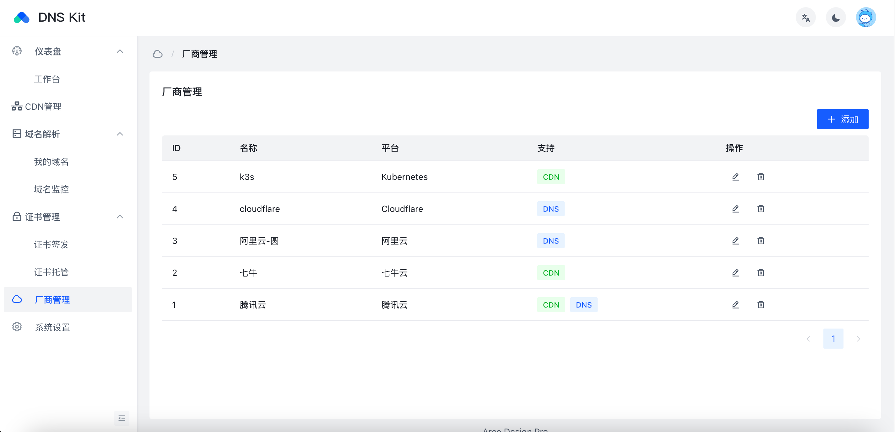

# DNS Kit
> 一个可以申请SSL证书部署到CDN的工具



## 功能

- 支持管理多平台DNS记录
- 支持管理多平台CDN
- 支持自动申请SSL证书
- 支持自动部署SSL证书到CDN

## 支持平台

- 腾讯云（CDN、DNS）
- 阿里云（DNS）
- 七牛云（CDN）
- Cloudflare（DNS）
- Kubernetes（CDN）

## 部署方式

### Docker（推荐）

```
docker run -d \
  -v $PWD/runtime:/app/runtime \
  -p 5174:5174 \
  --name dns-kit \
  --restart unless-stopped \
  codfrm/dns-kit:latest
```

### docker-compose（推荐）

```yaml
version: '3'

services:
  dns-kit:
    image: codfrm/dns-kit:latest
    container_name: dns-kit
    restart: unless-stopped
    volumes:
      - ./runtime:/app/runtime
    ports:
      - "5174:5174"
```

```bash
docker-compose up -d
```

### 从源代码

从源代码构建需要预先准备好以下环境：

- go 1.22+
- node 20+
- yarn

```bash
git clone https://github.com/CodFrm/dns-kit.git
cd dns-kit
make build
# 创建配置文件
cp ./configs/config.example.yaml ./configs/config.yaml
# 启动, 默认端口为5174
./bin/dns-kit
```

## 使用

访问 http://localhost:5174 默认账号密码为 `admin` `123456`

